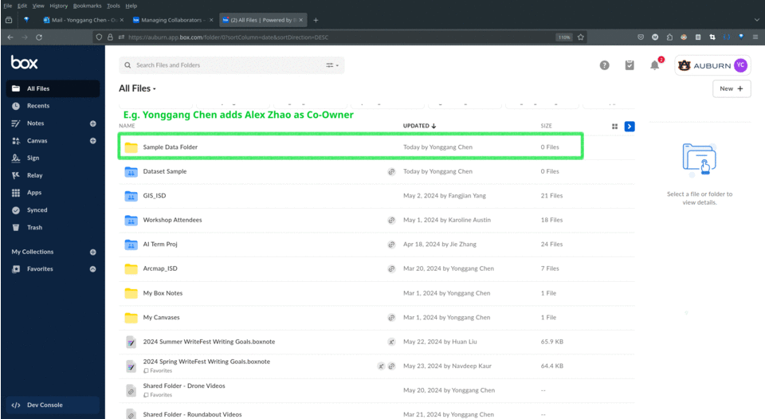
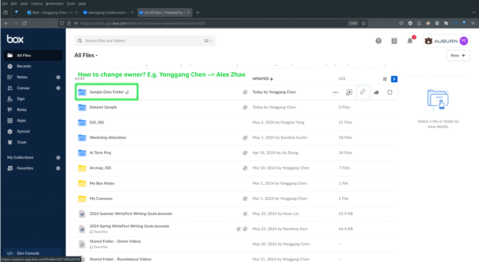

# User Guide for The Box 

These is a guide for data management using `the Box`.  

## How to

### How to add a co-owner after adding a new dataset for backup purpose? (#add-co-owner)

Please add <yzc0149> as co-owner for your new dataset directory. So, he can back up the folder to a portable disk offline.

### How to change the owner for an existing dataset before you graduate? (#change-owner)

Suggest you change the owner from you to <yzc0149> 1 month or earlier before you graduate.  

 
### How to add a new dataset? (#new-dataset)

TODO
    
### How to change/append data to an existing dataset? (#change-dataset)

TODO

